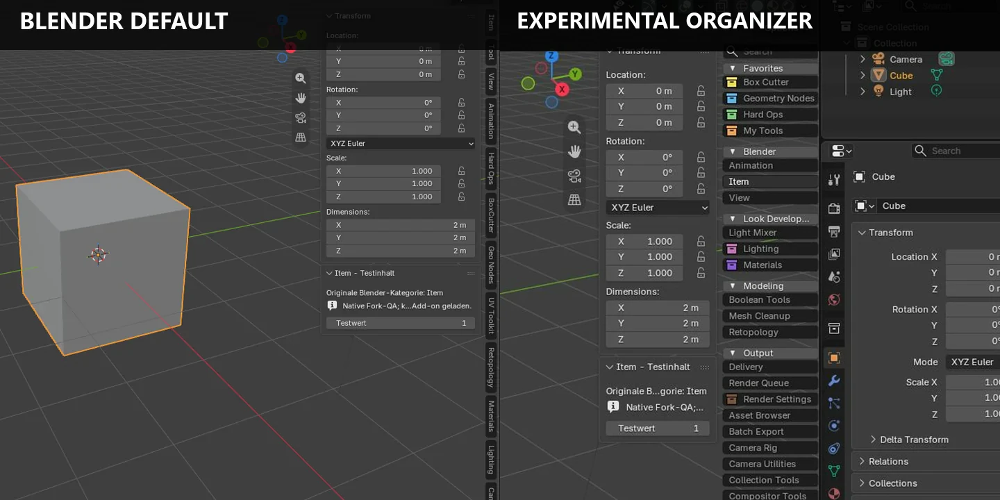
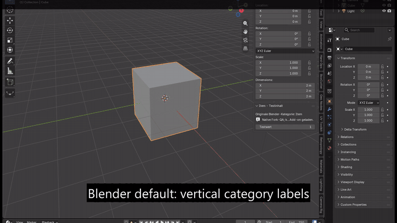
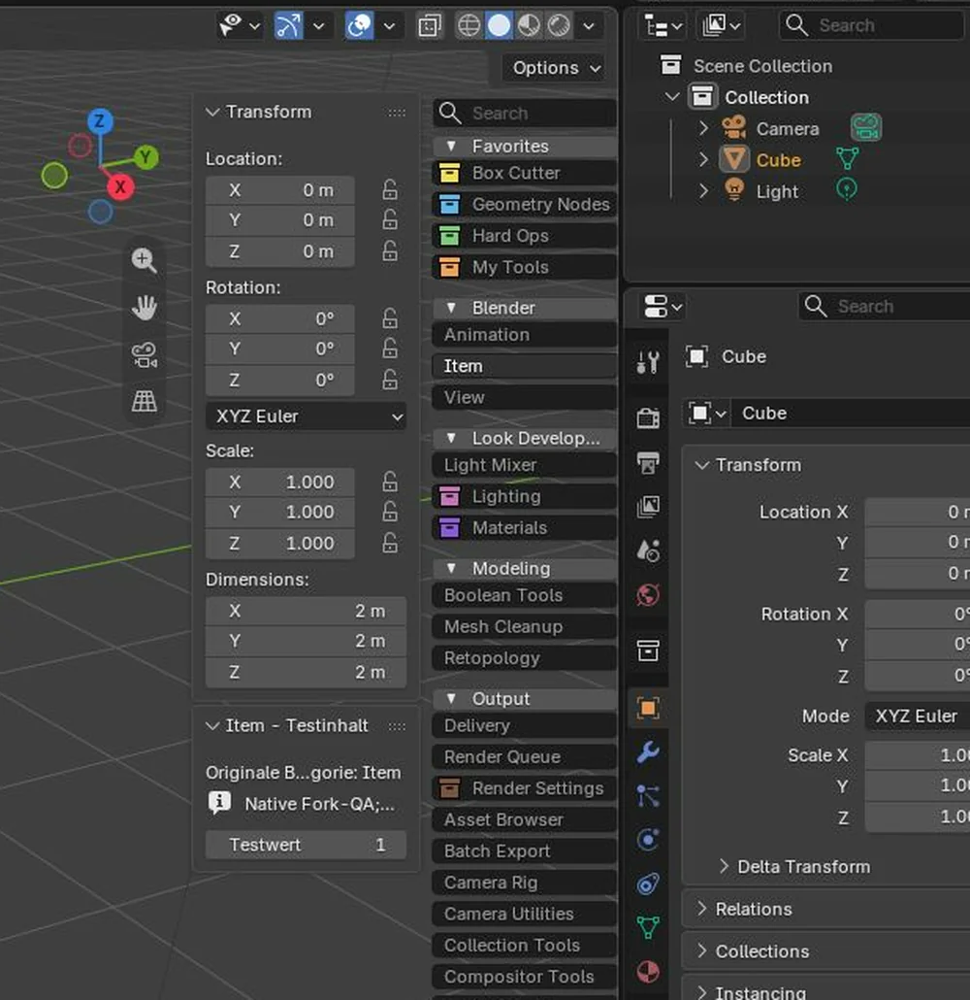
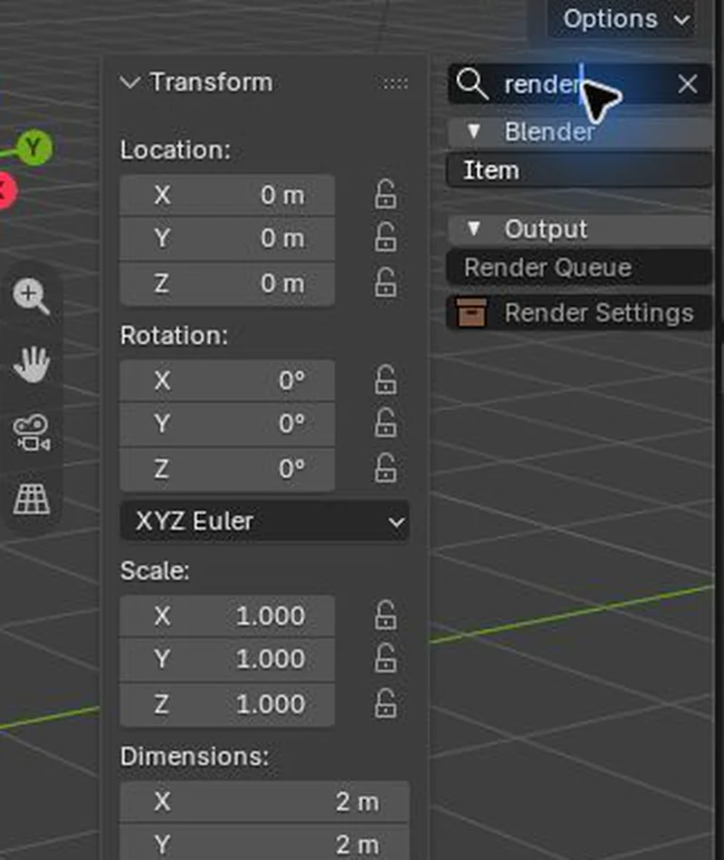
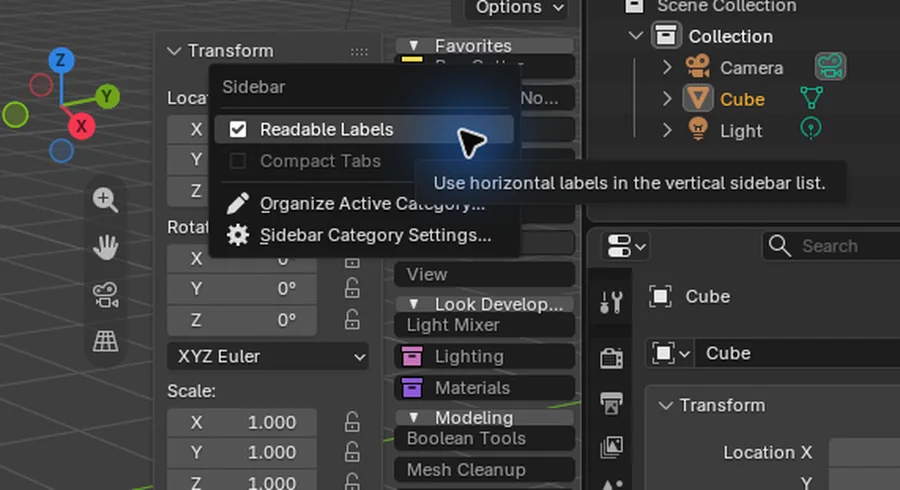
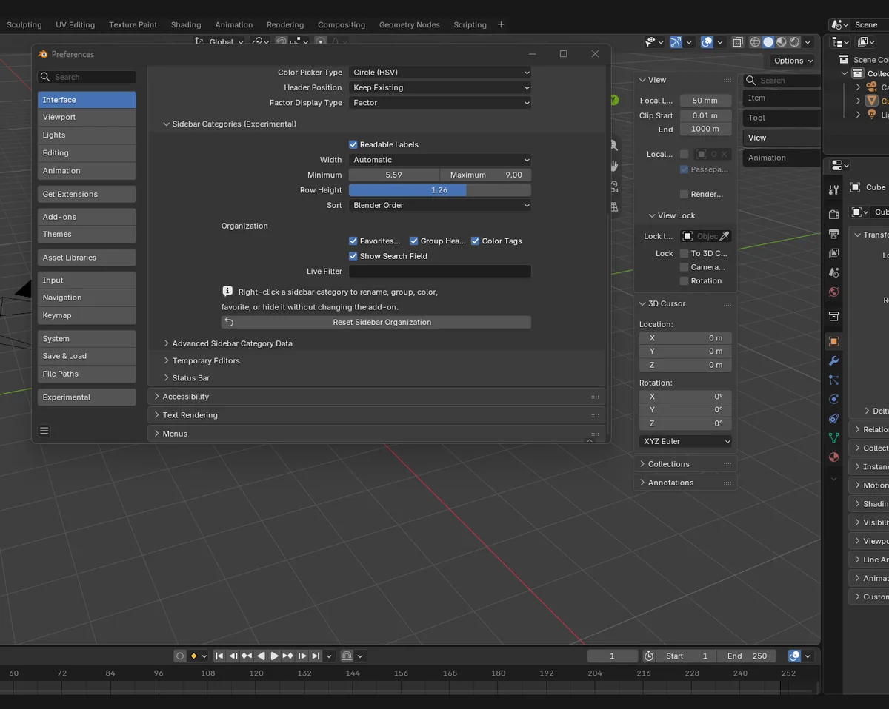

# Readable Sidebar Categories for Blender

An unofficial Blender experiment that keeps sidebar categories stacked vertically, but makes every label readable from left to right.

> [!WARNING]
> **Experimental Blender 5.3 Alpha build. Do not use it for production work or irreplaceable files.** Crashes, bugs, preference corruption, compatibility problems, and data loss cannot be ruled out. Use copies, keep backups, and keep your normal Blender installation separate.

<p align="center">
  
</p>

This repository documents two related tracks:

- **Small upstream proposal:** only the optional readable-label layout, currently discussed in [Blender pull request #162701](https://projects.blender.org/blender/blender/pulls/162701) and on [Blender DevTalk](https://devtalk.blender.org/t/optional-readable-labels-for-vertically-stacked-sidebar-categories/45657).
- **Experimental organizer:** a separate portable build that explores grouping, sorting, aliases, sizing, favorites, visibility controls, color tags, and live search. These extra features are **not** part of the upstream pull request.

## Try the portable build

[**Download Blender 5.3 Alpha — Experimental Sidebar Organizer v0.2 for Windows x64**](../../releases/tag/v0.2.0-experimental)

1. Download the ZIP and compare its SHA-256 checksum with [`CHECKSUMS-SHA256.txt`](CHECKSUMS-SHA256.txt).
2. Extract it into a short local path such as `C:\BlenderSidebarTest`. Do not run it from inside the ZIP; deeply nested paths can exceed legacy Windows path limits.
3. Start `blender-launcher.exe` from the extracted folder.
4. Use only disposable test files or copies of existing files.
5. Delete the extracted folder when finished. Its settings stay in the included `portable` folder and do not need to touch an installed Blender profile.

The release ZIP is deliberately attached to a GitHub Release instead of being stored in the Git repository.

## Short walkthrough

<p align="center">
  <a href="media/sidebar-organizer-demo-clean.mp4">
    
  </a>
</p>

[MP4 with captions](media/sidebar-organizer-demo-captioned.mp4) · [clean MP4](media/sidebar-organizer-demo-clean.mp4)

## What is implemented

| Area | Options |
| --- | --- |
| Readability | Horizontal text in Blender's existing vertical category list; immediate switch back to Blender's original layout |
| Width | Automatic width with minimum/maximum limits, or a fixed width |
| Density | Adjustable category row height |
| Ordering | Blender registration order, alphabetical order, or explicit custom order |
| Organization | Favorites-first, display-only aliases, groups with collapsible headers, and hidden categories |
| Identification | Eight native Blender color tags; add-on category identifiers remain unchanged |
| Search | Optional live search field; matches original identifiers, visible aliases, and group names |
| Safety guards | The active category remains reachable when a filter or hidden rule would otherwise remove it |
| Persistence | Organizer settings persist inside the portable profile |

<p align="center">
  
  
</p>

## Where the controls are

Right-click the sidebar category strip:

- **Readable Labels** switches between the experimental and original Blender presentation.
- **Organize Active Category…** edits the current category's alias, group, favorite state, visibility, and color tag.
- **Sidebar Category Settings…** opens the complete settings panel.

The same global settings are available at:

`Edit → Preferences → Interface → Editors → Sidebar Categories (Experimental)`

<p align="center">
  
</p>

<p align="center">
  
</p>

See [Settings and behavior](docs/SETTINGS.md) for each option and its current limitations.

## Experimental status

This is a demonstration of what a more readable and manageable sidebar could become. It was built and tested in an isolated Blender 5.3 Alpha portable to the best of the author's knowledge, but it has not received Blender's normal release testing and is not suitable for production.

Known boundaries:

- Windows x64 test build only.
- Global portable preferences, not per-workspace or per-`.blend` organization.
- No detachable category gutter.
- No drag-and-drop manager yet; custom ordering is currently entered as identifier data.
- No promised compatibility with third-party add-ons or future Blender builds.
- The executable is unsigned; Windows SmartScreen or security software may warn or block it. Do not disable security software to run this experiment.
- No Blender 5.1 installation or profile is modified by the provided portable workflow.

Read [Safety and disclaimer](DISCLAIMER.md) before running the binary. The exact checks performed for this build are listed in [QA report](docs/QA.md).

## Source and reproducibility

- Upstream project: <https://projects.blender.org/blender/blender>
- Exact upstream base: `4d6a448ec8e203a080b276c34ae73fb91078d088`
- Readable-label reference commit: `6a37f824a4c8af813d987ebd1afaf1f4275df8f1`
- Complete v0.2 patch: [`patches/blender-sidebar-organizer-v0.2-full.patch`](patches/blender-sidebar-organizer-v0.2-full.patch)

```bash
git clone https://projects.blender.org/blender/blender.git
cd blender
git checkout 4d6a448ec8e203a080b276c34ae73fb91078d088
git apply /path/to/blender-sidebar-organizer-v0.2-full.patch
```

Build the patched tree using Blender's official build instructions. See [Source and release provenance](SOURCE.md) for the precise scope.

## License and attribution

Blender and the modified source are distributed under the **GNU General Public License, version 2 or later**. See [LICENSE](LICENSE) and [SOURCE.md](SOURCE.md). The portable also contains Blender's standard `license` directory with dependency notices.

This project is unofficial and is not affiliated with or endorsed by the Blender Foundation. Blender and its visual identity belong to their respective rights holders. Screenshots and video show Blender solely to document the modification.

## Reporting problems

When reporting a problem, include the exact build name, Windows version, GPU, steps to reproduce, and whether the issue also occurs with **Readable Labels** disabled. Never attach confidential or irreplaceable `.blend` files; use a reduced reproduction file created from disposable data.
